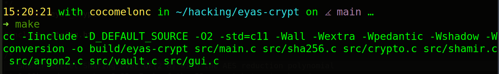
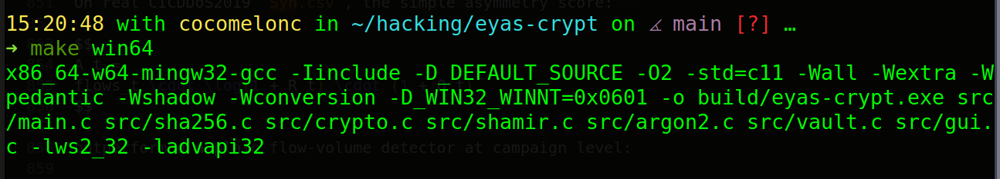
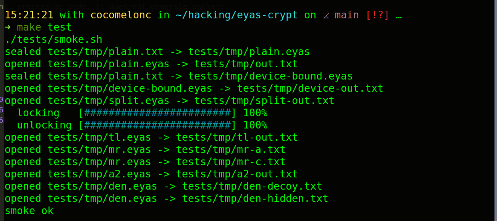
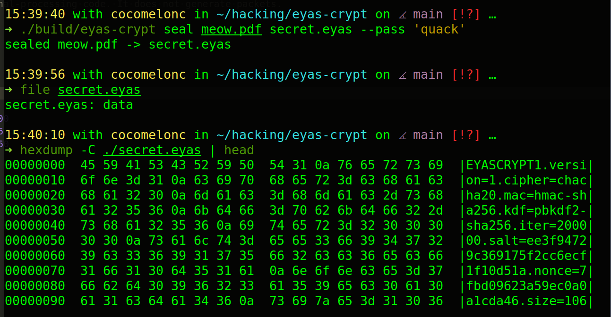
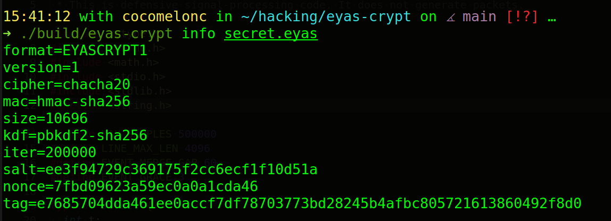
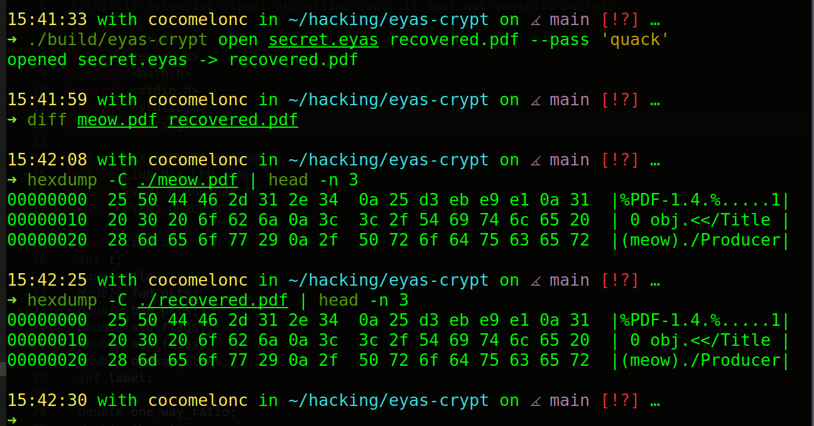
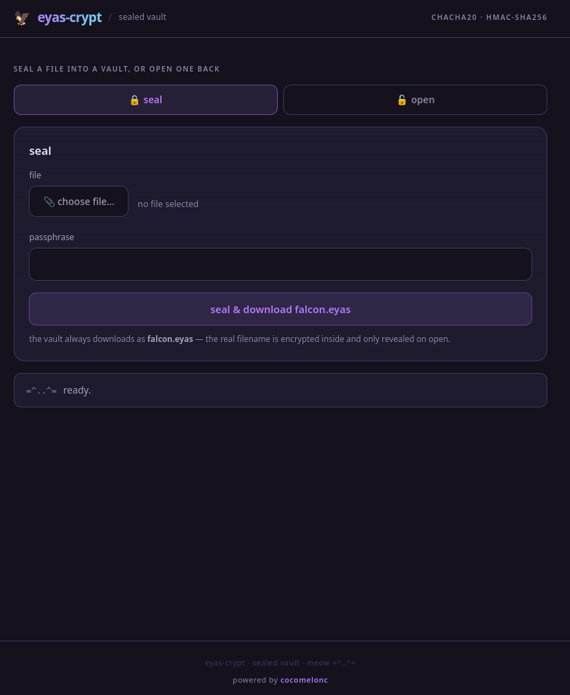

# eyas-crypt

Tiny cross-platform encrypted vault for DEFCON Demo Labs and workshops.     

`eyas-crypt` is a portable sealed vault: one file in, one `.eyas` file out. No
mount driver, no admin rights, no FUSE - just a self-contained binary.     

### features

- C11 only.
- No OpenSSL, Qt, GTK, Electron, FUSE, drivers, or external crypto library.
- Builds on Linux and cross-builds Windows binaries with MinGW.
- ChaCha20 encryption.
- HMAC-SHA256 authentication.
- PBKDF2-HMAC-SHA256 password stretching, or memory-hard Argon2id (RFC 9106).
- Tamper-evident public header.
- Device-bound vaults: passphrase alone is not enough.
- Threshold split-key vaults: K-of-N Shamir shares, no single share reveals anything.
- Time-lock vaults: opening requires a sequential, non-parallelizable delay.
- Multi-recipient vaults: any one of N passphrases opens the same vault.
- Deniable hidden vaults: a decoy and a hidden payload in one container.
- Local browser GUI served by the binary itself.

### build

compiling for linux:     

```bash
make
```

    

compiling Windows binary:     

```bash
make win64
```

    

make tests:    

```bash
make test
```

    

### CLI

encrypt:     

```bash
./build/eyas-crypt seal secret.pdf secret.eyas --pass 'demo passphrase'
```

    

info:     

```bash
./build/eyas-crypt info secret.eyas
```

    

decrypt:    

```bash
./build/eyas-crypt open secret.eyas recovered.pdf --pass 'demo passphrase'
```

    

another examples:    

```bash
./build/eyas-crypt seal secret.pdf secret.eyas --pass 'demo passphrase'
./build/eyas-crypt open secret.eyas recovered.pdf --pass 'demo passphrase'
./build/eyas-crypt info secret.eyas
./build/eyas-crypt enroll-device laptop.key
./build/eyas-crypt device-id laptop.key
./build/eyas-crypt seal secret.pdf secret.eyas --pass 'demo passphrase' --device laptop.key
./build/eyas-crypt open secret.eyas recovered.pdf --pass 'demo passphrase' --device laptop.key
```


Split-key (any 2 of 3 shares + passphrase reconstruct the vault):    

```bash
./build/eyas-crypt seal secret.pdf secret.eyas --pass 'team passphrase' --threshold 2 --shares 3
# writes secret.eyas plus secret.eyas.share1 .. secret.eyas.share3
./build/eyas-crypt open secret.eyas recovered.pdf --pass 'team passphrase' \
    --share secret.eyas.share1 --share secret.eyas.share3
```

Time-lock (cannot be opened until the work has been spent):    

```bash
./build/eyas-crypt seal secret.pdf secret.eyas --pass 'demo passphrase' --timelock 30
./build/eyas-crypt open secret.eyas recovered.pdf --pass 'demo passphrase'   # spends ~30s
```

Multi-recipient (any one passphrase opens it):    

```bash
./build/eyas-crypt seal secret.pdf secret.eyas --recipient alice --recipient bob --recipient carol
./build/eyas-crypt open secret.eyas recovered.pdf --pass bob
```

Argon2id memory-hard KDF:

```bash
./build/eyas-crypt seal secret.pdf secret.eyas --pass 'demo passphrase' --kdf argon2id --argon-m 65536
./build/eyas-crypt open secret.eyas recovered.pdf --pass 'demo passphrase'
```

Deniable hidden vault (two passphrases, one container):

```bash
./build/eyas-crypt seal decoy.pdf secret.eyas --pass decoyPass --hidden real.pdf --hidden-pass hiddenPass
./build/eyas-crypt open secret.eyas out.pdf --pass decoyPass     # -> decoy.pdf
./build/eyas-crypt open secret.eyas out.pdf --pass hiddenPass    # -> real.pdf
./build/eyas-crypt seal decoy.pdf cover.eyas --deniable --pass decoyPass   # decoy only, same shape
```

### GUI

```sh
./build/eyas-crypt gui --bind 127.0.0.1 --port 8765
```

Open `http://127.0.0.1:8765/`.

    

### design

Every vault carries an auditable cleartext header with non-secret parameters - KDF, iterations, salt, nonce, ciphertext size, policy, and MAC - so verification is easy:     

- anyone can inspect which KDF and parameters were used;
- tampering is detected before any plaintext is written;
- the encrypted payload does not reveal the original filename;
- no mount driver is required on the target system.

The trust model is explicit, and grows with the policy.     

**Device-bound** (`--device`): the enrolled device key is required in addition
to the passphrase; the header records `policy=passphrase+device-key` and a
`device_id`.    

**Threshold split-key** (`--threshold K --shares N`): the payload is encrypted
with a random data key, which is wrapped under the passphrase and a group
secret. The group secret is split into `N` Shamir shares over GF(2^8); any `K`
reconstruct it, while `K-1` reveal nothing (information-theoretic secrecy). The
header records `threshold`, `shares`, and a `group_id` so foreign shares are
rejected.     

**Time-lock** (`--timelock SECONDS`): the data key is wrapped under a value
derived from a sequential chain `tl = SHA-256^steps(seed)`. Each hash depends on
the previous one, so the chain cannot be parallelized across cores or machines -
the only way to unlock is to spend the wall-clock time. `seed` and `steps` are
public; the chain output is never stored.     

**Multi-recipient** (`--recipient ...`): the data key is wrapped once per
recipient passphrase into an independent slot. Any single recipient opens the
vault with only their own passphrase, and recipients never learn each other's.     

**Argon2id** (`--kdf argon2id`): keys are stretched with the memory-hard
Argon2id (RFC 9106), verified against the RFC 9106 test vector by
`eyas-crypt selftest` (run as part of `make test`).    

**Deniable** (`--hidden` / `--deniable`): a container holds two equal-size slots
after a small public header. Each slot is `salt | nonce | ChaCha20(body)`; the
body decrypts to a magic, an inner HMAC, the payload, and random padding.
Without the right passphrase a slot is indistinguishable from random bytes. The
decoy lives in slot 0; a hidden payload (if any) lives in slot 1, otherwise slot
1 is pure random and the container is byte-for-byte the same shape - so the
holder of the decoy passphrase cannot prove a hidden volume exists.    
